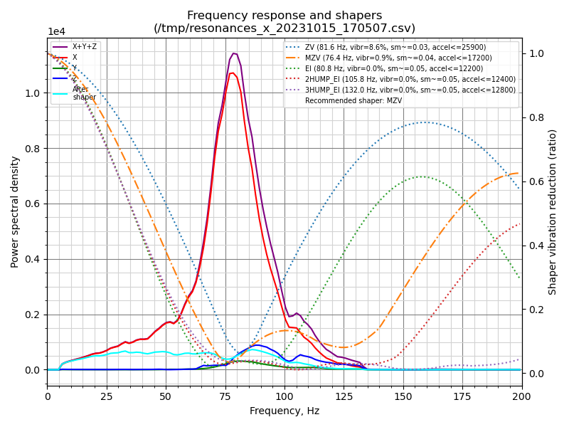
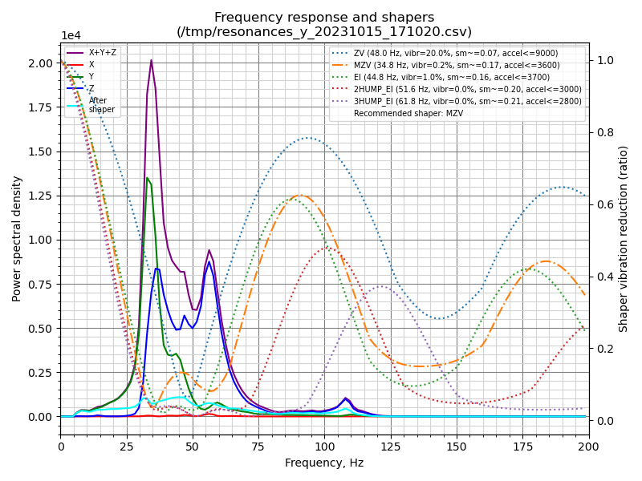

# input shaper
for future comparisson with coreXY
## X
```
 ~/klipper/scripts/calibrate_shaper.py /tmp/resonances_x_20231015_170507.csv -o /tmp/shaper_calibrate_x.png

Fitted shaper 'zv' frequency = 81.6 Hz (vibrations = 8.6%, smoothing ~= 0.030)
To avoid too much smoothing with 'zv', suggested max_accel <= 25900 mm/sec^2

Fitted shaper 'mzv' frequency = 76.4 Hz (vibrations = 0.9%, smoothing ~= 0.037)
To avoid too much smoothing with 'mzv', suggested max_accel <= 17200 mm/sec^2

Fitted shaper 'ei' frequency = 80.8 Hz (vibrations = 0.0%, smoothing ~= 0.049)
To avoid too much smoothing with 'ei', suggested max_accel <= 12200 mm/sec^2

Fitted shaper '2hump_ei' frequency = 105.8 Hz (vibrations = 0.0%, smoothing ~= 0.050)
To avoid too much smoothing with '2hump_ei', suggested max_accel <= 12400 mm/sec^2

Fitted shaper '3hump_ei' frequency = 132.0 Hz (vibrations = 0.0%, smoothing ~= 0.049)
To avoid too much smoothing with '3hump_ei', suggested max_accel <= 12800 mm/sec^2

Recommended shaper is mzv @ 76.4 Hz
```

## Y
```
 ~/klipper/scripts/calibrate_shaper.py /tmp/resonances_y_20231015_171020.csv -o /tmp/shaper_calibrate_y1.png

Fitted shaper 'zv' frequency = 48.0 Hz (vibrations = 20.0%, smoothing ~= 0.073)
To avoid too much smoothing with 'zv', suggested max_accel <= 9000 mm/sec^2

Fitted shaper 'mzv' frequency = 34.8 Hz (vibrations = 0.2%, smoothing ~= 0.168)
To avoid too much smoothing with 'mzv', suggested max_accel <= 3600 mm/sec^2

Fitted shaper 'ei' frequency = 44.8 Hz (vibrations = 1.0%, smoothing ~= 0.160)
To avoid too much smoothing with 'ei', suggested max_accel <= 3700 mm/sec^2

Fitted shaper '2hump_ei' frequency = 51.6 Hz (vibrations = 0.0%, smoothing ~= 0.203)
To avoid too much smoothing with '2hump_ei', suggested max_accel <= 3000 mm/sec^2

Fitted shaper '3hump_ei' frequency = 61.8 Hz (vibrations = 0.0%, smoothing ~= 0.215)
To avoid too much smoothing with '3hump_ei', suggested max_accel <= 2800 mm/sec^2

Recommended shaper is mzv @ 34.8 Hz
```
